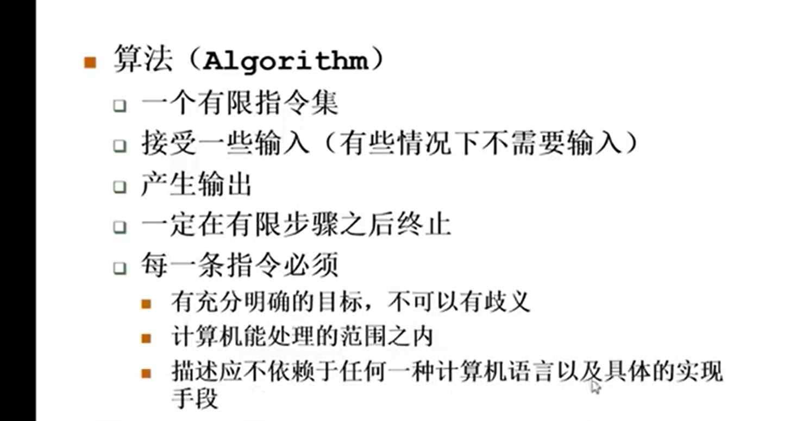
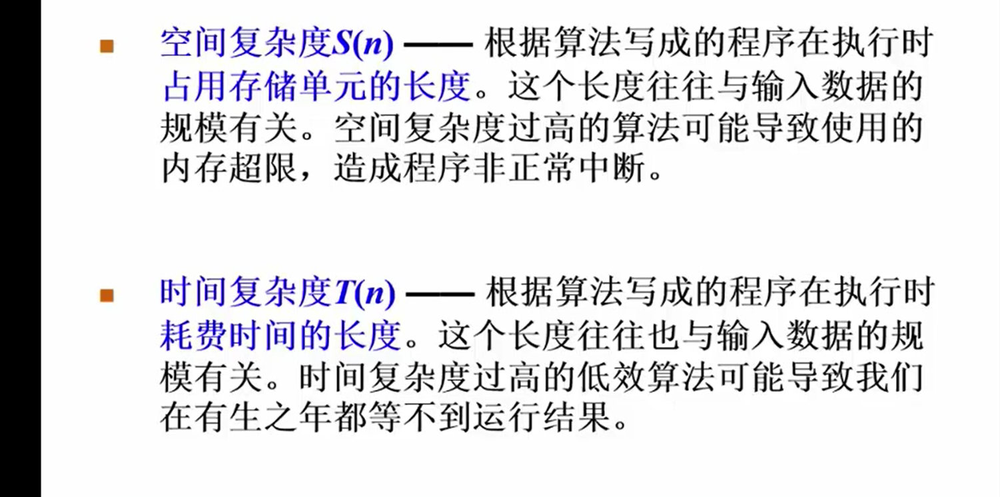
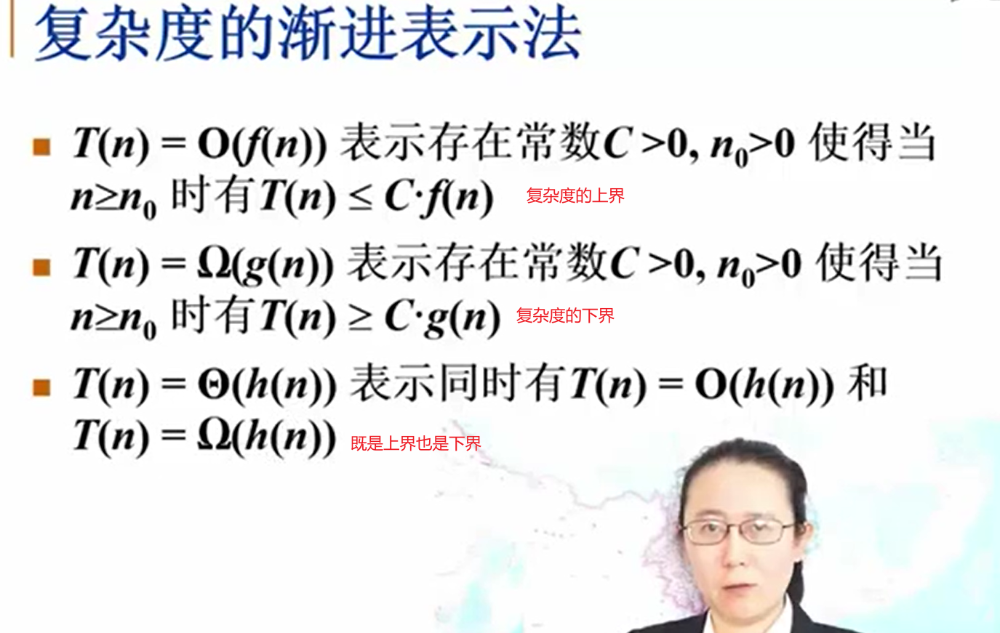
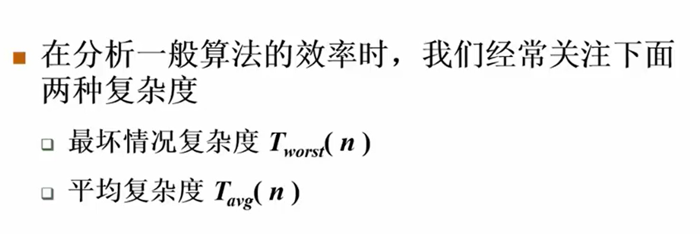

## 数据结构
+ 数据对象在计算机中的组织方式()
+ 数据对象对应的有哪些操作集(如何去进行操作)
  + 在用操作集的时候不用去考虑它是怎么实现的

## 算法
+ 定义:
  
+ 时间复杂度和空间复杂度
  
  
+ 分析算法时
  + 一般看最坏情况复杂度
  
+ 算法示例
  + 在线处理算法
    + 指每输入一个数据就进行即时处理,在任何一个地方停止输入都可以正确的得出目前的解
  + 分而治之的算法
    + 把大的问题切分成小的快,分别取进行解决,然后把结果合并起来(如,二分查找)